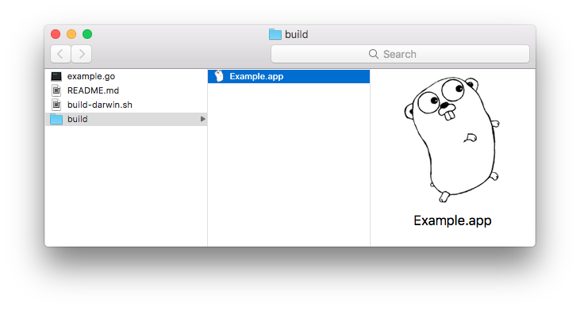
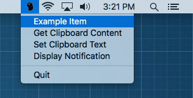

trayhost Example
================

macOS
-----

Run the following command in this directory to build the binary into target location:

```
go build -o build/Example.app/Contents/MacOS/example
```

The .app bundle inside build directory is now ready to be opened.




